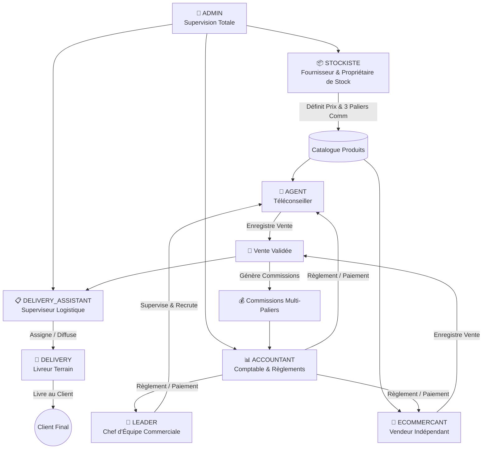

# 📚 Guide Global des Rôles & Fonctionnalités — AYLAN GROUP

Ce document présente l'architecture complète, les règles de gestion, les flux financiers et le fonctionnement pas à pas de la plateforme web **AYLAN GROUP** pour l'ensemble des 8 rôles du système.

---

## 🌟 Sommaire

1. [Vue d'Ensemble de l'Écosystème](#1-vue-densemble-de-lécosystème)
2. [Matrice des Droits & Permissions (8 Rôles)](#2-matrice-des-droits--permissions)
3. [Moteur Financier & Règles de Calcul](#3-moteur-financier--règles-de-calcul)
4. [Exemples Concrets de Flux Métier](#4-exemples-concrets-de-flux-métier)
5. [Guides Détaillés par Rôle](#5-guides-détaillés-par-rôle)

---

## 1. Vue d'Ensemble de l'Écosystème

La plateforme AYLAN GROUP structure les opérations commerciales, logistiques et financières autour de 8 rôles spécialisés :

---

## 2. Matrice des Droits & Permissions

| Fonctionnalité | ADMIN | STOCKISTE | ACCOUNTANT | LEADER | AGENT | ECOMMERCANT | ASST. LIVRAISON | LIVREUR |
| :--- | :---: | :---: | :---: | :---: | :---: | :---: | :---: | :---: |
| **Créer des Utilisateurs** | ✅ Tous | ❌ | ❌ | ✅ Ses Agents | ❌ | ❌ | ❌ | ❌ |
| **Créer des Produits** | ✅ | ✅ Ses produits | ❌ | ✅ Spécifiques | ❌ | ❌ | ❌ | ❌ |
| **Gérer les Mouvements Stock** | ✅ | ✅ Ses produits | ✅ | ❌ | ❌ | ❌ | ❌ | ❌ |
| **Accès CRM Prospects** | ✅ Tous | ❌ | ❌ | ✅ Son équipe | ✅ Ses prospects | ❌ | ❌ | ❌ |
| **Enregistrer des Ventes** | ✅ | ❌ | ❌ | ✅ Son équipe | ✅ Pour lui | ✅ Pour lui | ❌ | ❌ |
| **Voir les Ventes** | ✅ Toutes | ✅ Ses produits | ✅ Toutes | ✅ Son équipe | ✅ Ses ventes | ✅ Ses ventes | ✅ Toutes | ✅ Assignées |
| **Prise en charge Livraisons** | ✅ | ❌ | ❌ | ❌ | ❌ | ❌ | ✅ | ✅ |
| **Valider Paiement Comm.** | ✅ | ❌ | ✅ | ❌ | ❌ | ❌ | ❌ | ❌ |
| **Voir Répartition Gains** | ✅ Globale | ✅ Revenu Net | ✅ Globale | ✅ Ses gains | ✅ Ses comm. | ✅ Ses comm. | ❌ | ❌ |
| **Audit Logs** | ✅ | ❌ | ❌ | ❌ | ❌ | ❌ | ❌ | ❌ |

---

## 3. Moteur Financier & Règles de Calcul

Chaque produit créé sur la plateforme dispose de 3 paliers de commission configurables :
1. **Commission Téléconseiller (`agentCommission`)** : Versée à l'agent commercial rattaché à une équipe.
2. **Commission Leader (`leaderCommission`)** : Versée au chef d'équipe de l'agent qui a conclu la vente.
3. **Commission E-commerçant (`ecommercantCommission`)** : Versée au vendeur indépendant (sans leader).

### Formules de Répartition

$$\text{Montant Brut Vente} = \text{Prix Unitaire} \times \text{Quantité}$$

#### A. Cas Vente par un Téléconseiller (`AGENT`)
- **Gain Téléconseiller** = $\text{agentCommission} \times \text{Quantité}$
- **Gain Leader** = $\text{leaderCommission} \times \text{Quantité}$
- **Part Nette Stockiste** = $\text{Montant Brut} - \text{Gain Téléconseiller} - \text{Gain Leader}$

#### B. Cas Vente par un E-commerçant (`ECOMMERCANT`)
- **Gain E-commerçant** = $\text{ecommercantCommission} \times \text{Quantité}$
- **Gain Leader** = $0\text{ KMF}$
- **Part Nette Stockiste** = $\text{Montant Brut} - \text{Gain E-commerçant}$

---

## 4. Exemples Concrets de Flux Métier

### 💡 Exemple 1 : Vente de Panneaux Solaires par Téléconseiller
- **Produit** : Panneau Solaire 150W (Prix de vente : `30 000 KMF`, Prix d'achat : `18 000 KMF`)
- **Paramètres de Commissions** :
  - Téléconseiller : `3 000 KMF` / unité
  - Leader : `1 500 KMF` / unité
- **Scénario** : L'agent Paul (Team Leader Nord) vend **2 panneaux solaires** avec livraison à Moroni.
- **Résultats Financiers** :
  - Chiffre d'Affaires Brut : $30\,000 \times 2 = \mathbf{60\,000\text{ KMF}}$
  - Commission Paul (Agent) : $3\,000 \times 2 = \mathbf{6\,000\text{ KMF}}$
  - Commission Leader Nord : $1\,500 \times 2 = \mathbf{3\,000\text{ KMF}}$
  - Revenu Net Stockiste : $60\,000 - 6\,000 - 3\,000 = \mathbf{51\,000\text{ KMF}}$
  - Stock : Décrémenté de **2 unités** automatiquement.

---

### 💡 Exemple 2 : Vente en Direct par un E-commerçant
- **Produit** : Climatiseur Inverter (Prix de vente : `250 000 KMF`)
- **Paramètres de Commissions** :
  - E-commerçant : `30 000 KMF` / unité
- **Scénario** : Sara, e-commerçante indépendante, conclut **1 vente**.
- **Résultats Financiers** :
  - Chiffre d'Affaires Brut : $\mathbf{250\,000\text{ KMF}}$
  - Commission Sara : $\mathbf{30\,000\text{ KMF}}$
  - Commission Leader : $\mathbf{0\text{ KMF}}$
  - Revenu Net Stockiste : $250\,000 - 30\,000 = \mathbf{220\,000\text{ KMF}}$

---

### 💡 Exemple 3 : Logistique & Prise en Charge par le Livreur
1. Une commande avec `DELIVERY` à *Moroni - Boulevard de la Corniche* est enregistrée.
2. Une notification automatique est envoyée aux livreurs disponibles (`isAvailable = true`).
3. Le livreur Ali clique sur **« Accepter la livraison »** :
   - Son statut passe en **Occupé** (`isAvailable = false`).
   - La commande passe au statut **En route (`SHIPPED`)**.
   - Le bordereau de livraison imprimable et le contact client WhatsApp sont accessibles.
4. Une fois le colis remis et encaissé, Ali clique sur **« Marquer livrée »** :
   - La commande passe à **`DELIVERED`**.
   - Ali redevient disponible (`isAvailable = true`).
   - Les commissions sont débloquées pour paiement comptable.

---

## 5. Guides Détaillés par Rôle

Consultez le guide dédié à chaque profil pour une documentation exhaustive des écrans, actions et cas d'usage :

1. [👑 Guide Administrateur (ADMIN)](file:///d:/aylan-building/docs/roles/01_ADMIN.md)
2. [📦 Guide Stockiste (STOCKISTE)](file:///d:/aylan-building/docs/roles/02_STOCKISTE.md)
3. [🎯 Guide Leader d'Équipe (LEADER)](file:///d:/aylan-building/docs/roles/03_LEADER.md)
4. [💼 Guide Téléconseiller (AGENT)](file:///d:/aylan-building/docs/roles/04_AGENT.md)
5. [🛒 Guide E-commerçant Indépendant (ECOMMERCANT)](file:///d:/aylan-building/docs/roles/05_ECOMMERCANT.md)
6. [📊 Guide Comptable (ACCOUNTANT)](file:///d:/aylan-building/docs/roles/06_ACCOUNTANT.md)
7. [📋 Guide Assistant Livraisons (DELIVERY_ASSISTANT)](file:///d:/aylan-building/docs/roles/07_DELIVERY_ASSISTANT.md)
8. [🚚 Guide Livreur Terrain (DELIVERY)](file:///d:/aylan-building/docs/roles/08_DELIVERY.md)
